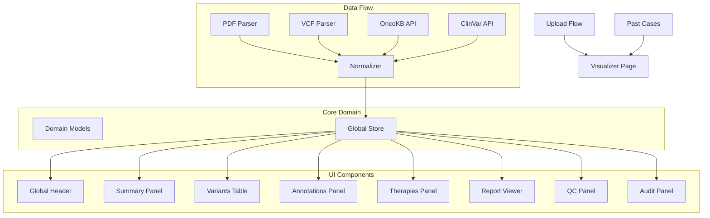

# OncoFHIR Lens Visualizer

The OncoFHIR Lens Visualizer is a single-page, segmented visualization tool for genomic reports. It provides a unified interface for viewing and analyzing both PDF and VCF genomic reports.

## Architecture



## Features

1. **Single-Page Visualizer**
   - Unified interface for PDF and VCF reports
   - Global search and filtering
   - Cross-panel highlighting and synchronization

2. **Segmented Panels**
   - Summary
   - Variants (Master Table)
   - Annotations
   - Therapies / Drug Matches
   - Report Viewer
   - QC & Provenance
   - Audit & Notes

3. **Cross-Panel Features**
   - Global search and filters
   - Cross-highlighting of selected variants
   - URL state persistence
   - Keyboard shortcuts

## Development

### Prerequisites

- Node.js 18+
- npm or yarn
- OncoKB API token (for annotations)

### Setup

1. Install dependencies:
   ```bash
   npm install
   ```

2. Configure environment variables:
   ```bash
   cp .env.local.example .env.local
   # Edit .env.local with your OncoKB token
   ```

3. Run development server:
   ```bash
   npm run dev
   ```

### Project Structure

```
src/
├── adapters/           # Data normalization and API clients
├── app/
│   └── visualizer/    # Main visualizer page
├── components/
│   └── visualizer/    # Visualizer-specific components
├── core/              # Domain models and types
└── lib/
    └── store/         # Global state management
```

### Testing

Run the test suite:
```bash
npm test
```

This will run:
- Unit tests for normalizers and adapters
- Component tests for UI elements
- E2E tests for the complete visualizer flow

## Usage

1. Upload a genomic report (PDF or VCF)
2. The system will automatically redirect to the visualizer
3. Use the global search and filters to explore the data
4. Select variants to see corresponding annotations and evidence
5. View and export suggested therapies
6. Access the original report with highlighted annotations

## Keyboard Shortcuts

- `←/→`: Navigate between variants
- `Tab`: Switch panels
- `Ctrl/Cmd + F`: Focus global search
- `Esc`: Clear selection
